# Perfil del Proyecto

## Introducción

Las veterinarias que no cuentan con un sistema digital de gestión enfrentan limitaciones en el seguimiento de la salud de las mascotas. Actualmente, gran parte de la información —como historial veterinario, tratamientos o antecedentes veterinarios— se registra manualmente en documentos físicos. Este procedimiento genera riesgos de pérdida de datos, dificulta la búsqueda rápida de información y provoca desconexión entre las áreas de atención. Estas deficiencias afectan la agilidad del servicio y la confianza de los propietarios.

Este proyecto propone una solución digital parcial, centrada en los módulos de consultas veterinarias. El objetivo es facilitar el trabajo del personal veterinario, mejorar la trazabilidad del paciente y mejorar la atención mediante un sistema web que digitalice el flujo de trabajo en consultorios veterinarios.

## Identificación del problema

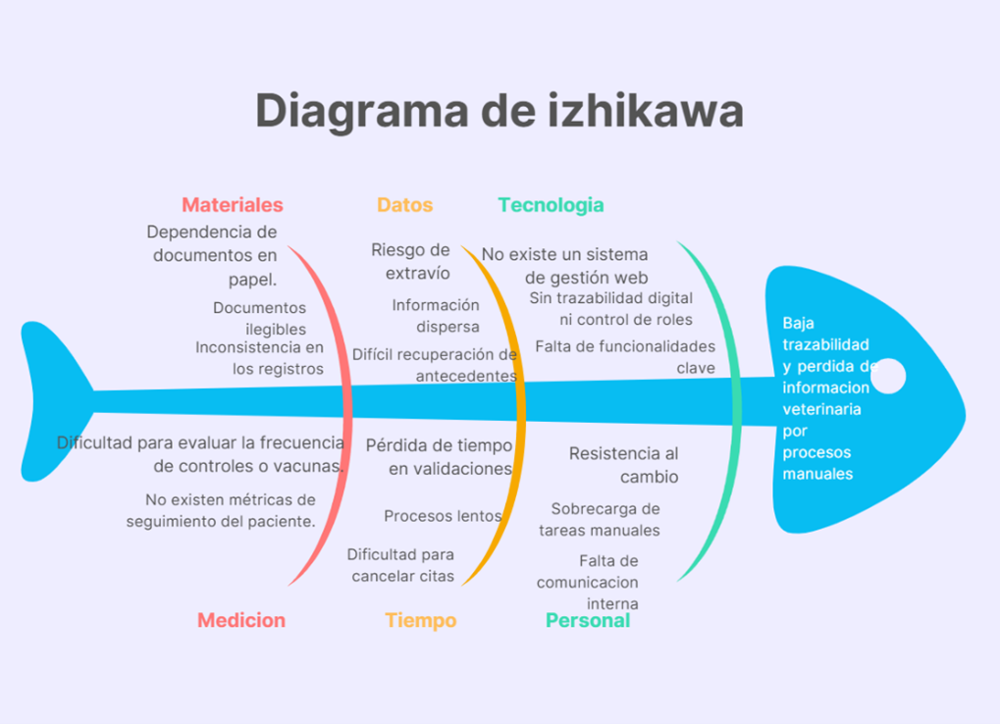{width=85%}

El diagrama de Ishikawa expone las causas principales que generan baja trazabilidad, pérdida de información y lentitud en el registro de atenciones en las veterinarias. Estas causas se agrupan en categorías como materiales, datos, tecnología y personal. Se identifican factores como la dependencia de documentos físicos, errores de transcripción manual, ausencia de un sistema digital, falta de métricas y resistencia al uso de tecnología. Todo esto repercute negativamente en la fluidez del servicio y en la continuidad de los tratamientos.

El problema abarca tanto la falta de herramientas tecnológicas como aspectos organizativos. La sobrecarga de tareas manuales y la inexistencia de un historial veterinario digital impiden ofrecer una atención rápida. Por tanto, la solución propuesta busca centralizar la información veterinaria y mejorar la programación de consultas.

## Objetivo General

Desarrollar un sistema web que digitalice los procesos de atención de las consultas de las mascotas en una veterinaria.

## Objetivos Específicos

-   Diseñar una base de datos relacional para organizar la información de dueños, mascotas y consultas.
-   Diseñar un módulo para que el recepcionista gestione el registro de pacientes y la programación de consultas.
-   Diseñar un módulo para que el veterinario registre la información veterinaria de las consultas realizadas.
-   Diseñar un sistema de autenticación para diferenciar el acceso entre recepcionistas y veterinarios.

## Límites y Alcances

### Límites: 
-   No se digitalizarán todas las áreas de la veterinaria 
-   No se tomara en cuenta el acceso del dueño mediante el sistema
-   No se desarrollarán aplicaciones móviles.
-   No se llevará el prototipo a producción.
-   El sistema funcionará para una sola sucursal veterinaria.
-   No se incluyen funciones avanzadas de gestión de cuenta.
-   No se realizarán pruebas de carga ni optimización avanzada de base de datos.
-   No se incluye el seguimiento detallado de tratamientos complejos.
-   No incluye notificacion o recordatorios de consultas.
-   No se contemplara la exportacion de datos
-   No se contemplara la impresion de fichas de consulta

### Alcances: 
-   Registro digital de mascotas y dueños.
-   Gestión de historial veterinario básico con datos del veterinario que atendió.
-   Roles diferenciados para recepcionista y veterinario.
-   Visualización de reportes básicos del historial.
-   Trazabilidad de las mascotas mediante historiales centralizados.
-   Gestión y trazabilidad de las consultas programadas.
  

## Tecnologías a usar

\begin{longtable}{|p{3cm}|p{3cm}|p{9cm}|}
\hline
\rowcolor{headerblue} \bfseries \color{white} Capa & \bfseries \color{white} Tecnología & \bfseries \color{white} Justificación \\ \hline
\endhead
\textbf{Backend} & Python Django & Framework seguro y rápido para crear la lógica del servidor y APIs. \\ \hline
\textbf{Frontend} & React & Librería para interfaces dinámicas y responsivas. \\ \hline
\textbf{Base Datos} & PostgreSQL & Base de datos relacional robusta para mantener la integridad de la información. \\ \hline
\textbf{Contenedor} & Docker & Empaquetado de la aplicación para que funcione igual en cualquier equipo. \\ \hline
\textbf{Hosting} & AWS & Infraestructura en la nube para desplegar el prototipo. \\ \hline
\end{longtable}

---

# Diagrama de Contexto

## Identificacion del proyecto

### Nombre del proyecto TPS

Sistema Veterinario

### Breve descripcion del proposito del sistema

Diseñar, modelar y prototipar un sistema web parcial para consultorios veterinarios. Enfocándose en las consultas veterinarias, busca mejorar la trazabilidad de los pacientes y agilizar la atención al eliminar el papel. El sistema incluye la gestión de consultas y autenticación para el personal.

## Modelo de contexto del sistema

A continuacion se muestra el diagrama de contexto del sistema:

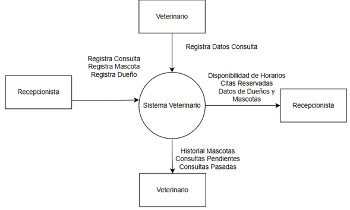{width=85%}

## Descripcion de actores y flujos
\begin{longtable}{|p{3cm}|p{2cm}|p{5cm}|p{5cm}|}
\hline
\rowcolor{headerblue} \bfseries \color{white} Actor & \bfseries \color{white} Tipo & \bfseries \color{white} Descripción Rol & \bfseries \color{white} Flujo Información \\ \hline
\endhead
\textbf{Veterinario} & Persona & Personal veterinario encargado de la atención de las mascotas & \textbf{Entrada:} Datos de la consulta veterinaria. \newline \textbf{Salida:} Historial actualizado. \\ \hline
\textbf{Recepcionista} & Persona & Personal encargado de la programación y registro & \textbf{Entrada:} Datos de consulta, dueño y mascota. \newline \textbf{Salida:} Horarios disponibles, Consultas agendadas. \\ \hline
\end{longtable}

# Diagrama BPMN

\includepdf[pages=-, pagecommand={\thispagestyle{plain}}, scale=0.85]{assets/bpmn.pdf}

# Requerimientos funcionales y no funcionales

## Requerimientos Funcionales

\begin{longtable}{|p{1.2cm}|p{3.8cm}|p{8.5cm}|p{2cm}|}
\hline
\rowcolor{headerblue} \bfseries \color{white} ID & \bfseries \color{white} Nombre & \bfseries \color{white} Descripción & \bfseries \color{white} Prioridad \\ \hline
\endhead
RF1 & Registrar Mascota & Permitir ingresar y guardar datos de una mascota. & Must \\ \hline
RF2 & Mostrar Mascotas & Ver lista y detalles de mascotas registradas. & Must \\ \hline
RF3 & Actualizar Mascota & Editar información de una mascota. & Should \\ \hline
RF4 & Eliminar Mascota & Borrar registros de mascotas. & Should \\ \hline
RF5 & Registrar Dueño & Permitir ingresar y guardar datos de un dueño. & Must \\ \hline
RF6 & Mostrar Dueños & Ver lista y detalles de dueños registrados. & Must \\ \hline
RF7 & Actualizar Dueño & Editar información de un dueño. & Should \\ \hline
RF8 & Eliminar Dueño & Borrar registros de dueño. & Should \\ \hline
RF9 & Agendar Consulta & Programar una consulta para una mascota en una fecha específica. & Must \\ \hline
RF10 & Mostrar Consultas & Listar todas las consultas registradas/programadas. & Must \\ \hline
RF11 & Modificar Consulta & Permitir la edición de una consulta programada. & Should \\ \hline
RF12 & Eliminar Consulta & Cancelar o eliminar una consulta. & Should \\ \hline
RF13 & Consultar Historial & Ver todas las consultas pasadas de una mascota. & Must \\ \hline
RF14 & Registrar Atención & Permite al veterinario guardar los datos veterinarios de la consulta (diagnóstico, etc.). & Must \\ \hline
RF15 & Iniciar Sesión & Validar credenciales (recepcionista, veterinario). & Must \\ \hline
RF16 & Cerrar Sesión & Salir del sistema de forma segura. & Must \\ \hline
RF17 & Gestión de Roles & Controlar permisos según sea recepcionista o veterinario. & Must \\ \hline
\end{longtable}

## Requerimientos No Funcionales

\begin{longtable}{|p{1.2cm}|p{3.8cm}|p{8.5cm}|p{2cm}|}
\hline
\rowcolor{headerblue} \bfseries \color{white} ID & \bfseries \color{white} Nombre & \bfseries \color{white} Descripción & \bfseries \color{white} Prioridad \\ \hline
\endhead
RNF1 & Seguridad & Protección de datos y control de accesos. & Must \\ \hline
RNF2 & Usabilidad & Interfaz fácil de usar para el personal. & Must \\ \hline
RNF3 & Rendimiento & Operaciones básicas rápidas (menos de 5 seg). & Should \\ \hline
RNF4 & Escalabilidad & Estructura preparada para crecimiento futuro. & Could \\ \hline
RNF5 & Disponibilidad & El sistema debe estar disponible al menos el 95\% del tiempo. & Should \\ \hline
RNF6 & Portabilidad & Compatible con navegadores modernos. & Should \\ \hline
RNF7 & Mantenibilidad & Código ordenado para futuras actualizaciones. & Could \\ \hline
RNF8 & Integridad de Datos & Evitar duplicidad o corrupción de información. & Must \\ \hline
RNF9 & Respaldo & Copias de seguridad de la base de datos. & Should \\ \hline
RNF10 & Compatibilidad & Adaptable a pantallas de PC y móviles. & Should \\ \hline
\end{longtable}

# UML

## Diagrama de casos de uso

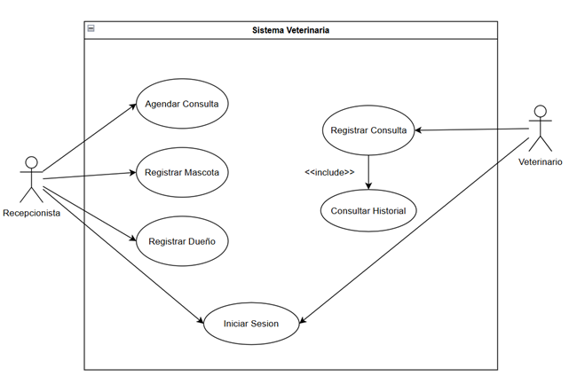{width=85%}

## Diagrama de actividades

### Agendar Consulta 
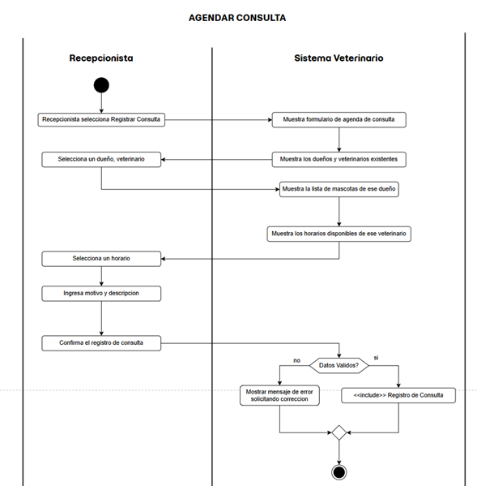{width=85%}

### Registrar Mascota 
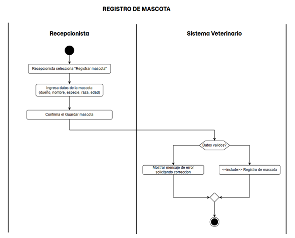{width=85%}

### Iniciar Sesion 
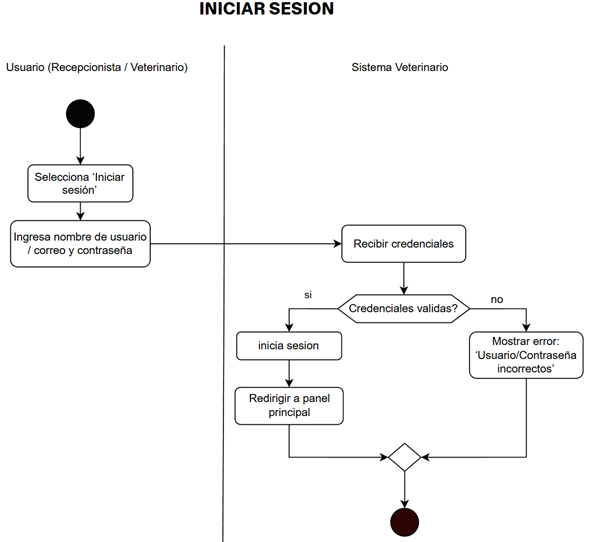{width=85%}

### Registrar Consulta (Atención veterinaria)
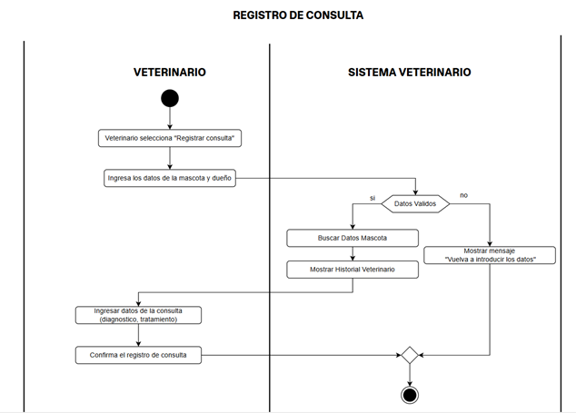{width=85%}

### Consultar Historial 
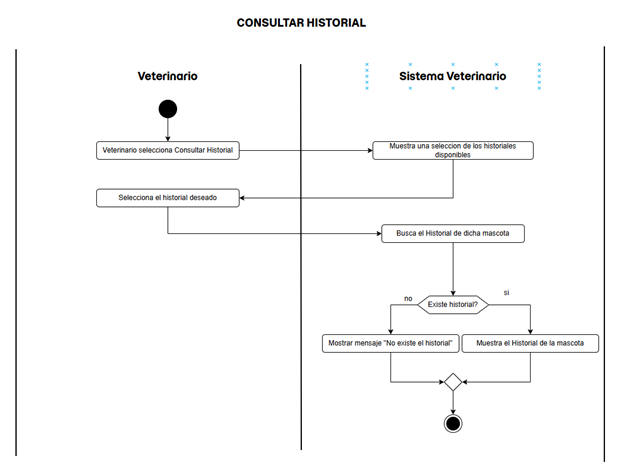{width=85%}

### Registrar Dueño 
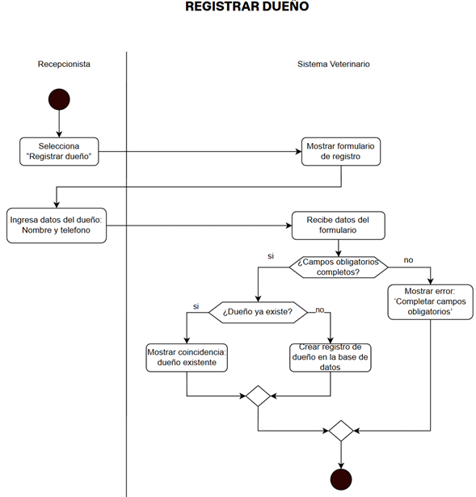{width=85%}

## Diagrama de secuencia

### Registrar Dueño
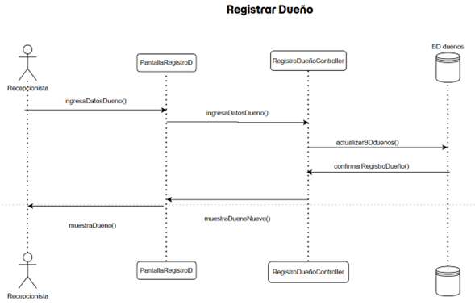{width=85%}

### Agendar Consulta
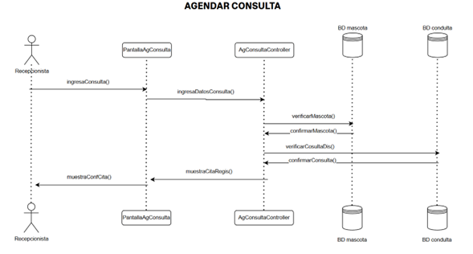{width=85%}

### Registrar Mascota
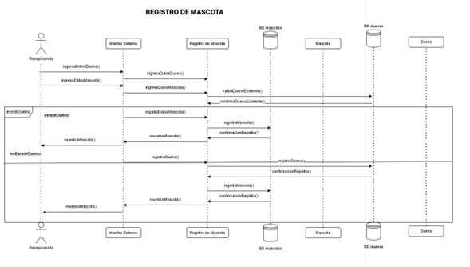{width=85%}

### Iniciar Sesion
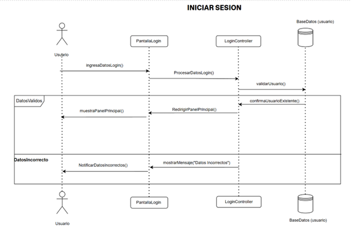{width=85%}

### Registrar Consulta (Atención veterinaria)
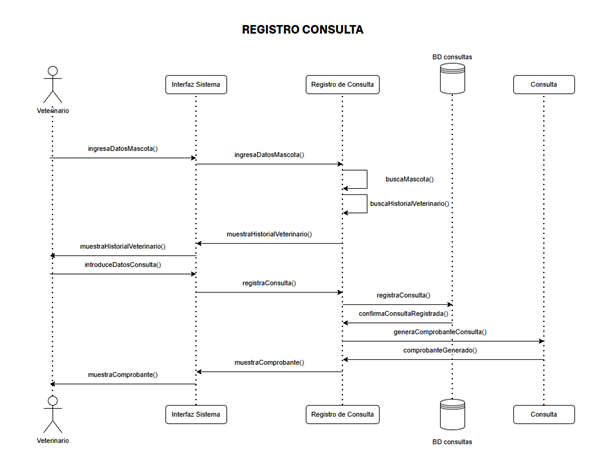{width=85%}

### Consultar Historial
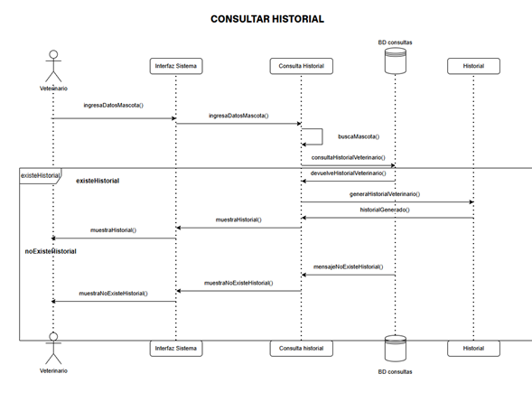{width=85%}

## Diagrama de clases

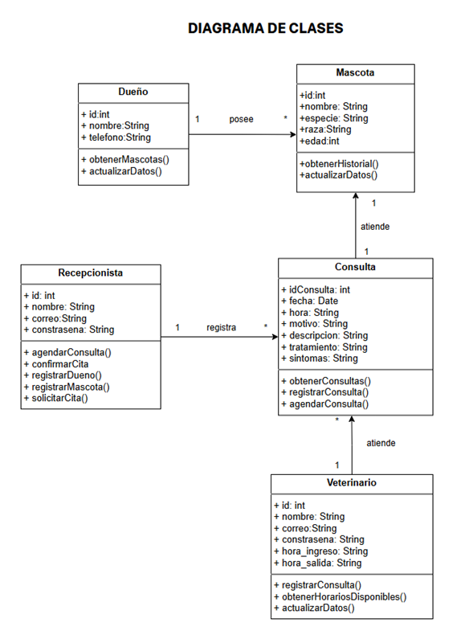{width=85%}

## Maqueta 

\includepdf[pages=-, pagecommand={\thispagestyle{plain}}, scale=0.85]{assets/maquetado.pdf}

## Escenarios

### Escenario: Registrar Dueño

\begin{longtable}{|p{7.5cm}|p{7.5cm}|}
\hline
\rowcolor{headerblue} \bfseries \color{white} Actor (Recepcionista) & \bfseries \color{white} Sistema \\ \hline
\endhead
1. Ingresa los datos del dueño. & \\ \hline
& 2. Muestra mensaje de confirmación. \\ \hline
3. Acepta la confirmación de los datos. & \\ \hline
& 4. Registra los datos del dueño. \\ \hline
\end{longtable}

### Escenario: Registrar Mascota

\begin{longtable}{|p{7.5cm}|p{7.5cm}|}
\hline
\rowcolor{headerblue} \bfseries \color{white} Actor (Recepcionista) & \bfseries \color{white} Sistema \\ \hline
\endhead
& 1. Busca los dueños disponibles y los muestra. \\ \hline
2. Selecciona un dueño e ingresa los datos de la mascota. & \\ \hline
& 3. Muestra mensaje de confirmación. \\ \hline
4. Acepta la confirmación de los datos. & \\ \hline
& 5. Registra los datos de la mascota. \\ \hline
\end{longtable}

### Escenario: Registrar Atención de Consulta (Veterinario)

\begin{longtable}{|p{7.5cm}|p{7.5cm}|}
\hline
\rowcolor{headerblue} \bfseries \color{white} Actor (Veterinario) & \bfseries \color{white} Sistema \\ \hline
\endhead
& 1. Muestra las consultas existentes. \\ \hline
2. Selecciona una consulta. & \\ \hline
& 3. Muestra los detalles de dicha consulta. \\ \hline
4. Registra el diagnóstico y el tratamiento si es que hay. & \\ \hline
& 5. Muestra un mensaje de confirmación. \\ \hline
6. Acepta la confirmación. & \\ \hline
& 7. Registra la consulta y muestra mensaje de consulta registrada. \\ \hline
\end{longtable}

### Escenario: Agendar Consulta (Recepcionista)

\begin{longtable}{|p{7.5cm}|p{7.5cm}|}
\hline
\rowcolor{headerblue} \bfseries \color{white} Actor (Recepcionista) & \bfseries \color{white} Sistema \\ \hline
\endhead
& 1. Muestra los veterinarios disponibles y los dueños existentes. \\ \hline
2. Selecciona un veterinario y selecciona a un dueño. & \\ \hline
& 3. Muestra las mascotas de ese dueño y los horarios disponibles. \\ \hline
4. Selecciona la mascota y el horario. & \\ \hline
& 5. Muestra un mensaje de confirmación. \\ \hline
6. Acepta la confirmación y reserva la consulta. & \\ \hline
& 7. Registra la consulta y muestra mensaje de consulta creada. \\ \hline
\end{longtable}

### Escenario: Iniciar Sesión

\begin{longtable}{|p{7.5cm}|p{7.5cm}|}
\hline
\rowcolor{headerblue} \bfseries \color{white} Actor (Usuario) & \bfseries \color{white} Sistema \\ \hline
\endhead
1. Ingresa sus datos personales (correo y contraseña). & \\ \hline
& 2. Valida los datos del usuario y muestra la pantalla principal según el perfil del usuario. \\ \hline
\end{longtable}

### Escenario: Consultar Historial

\begin{longtable}{|p{7.5cm}|p{7.5cm}|}
\hline
\rowcolor{headerblue} \bfseries \color{white} Actor (Recepcionista) & \bfseries \color{white} Sistema \\ \hline
\endhead
& 1. Busca los dueños disponibles y los muestra. \\ \hline
2. Selecciona un dueño. & \\ \hline
& 3. Muestra las mascotas de dicho dueño. \\ \hline
4. Selecciona la mascota. & \\ \hline
& 5. Muestra el historial veterinario de dicha mascota. \\ \hline
\end{longtable}

# Conclusiones

En conclusión, se cumplió con el objetivo general mediante el diseño y construcción de un prototipo web funcional que simula la digitalización de los procesos básicos de una veterinaria.

El prototipo desarrollado puede verse en el siguiente enlace: 

\underline{\textbf{\href{https://proyecto-sis225.tumype.com}{Proyecto SIS 225}}}

Aunque el sistema no se ha implementado en un entorno real, el desarrollo del prototipo permitió validar la propuesta técnica y funcional a través de los siguientes puntos:

- **Estructura de Datos:** Se modeló una base de datos relacional que organiza la información de dueños, mascotas y consultas, demostrando teóricamente cómo se puede centralizar la información y evitar el uso de papel.
- **Gestión Administrativa:** Se construyeron las interfaces y la lógica necesaria para simular cómo un recepcionista registra datos y programa consultas en un entorno digital.
- **Atención Veterinaria:** Se desarrolló un módulo de prueba que permite al perfil de veterinario guardar diagnósticos, verificando la viabilidad de llevar un historial digital ordenado.
- **Seguridad y Acceso:** Se programó un mecanismo de autenticación que distingue correctamente los roles de Recepcionista y Veterinario dentro del prototipo, restringiendo el acceso a las funciones según corresponda.

En resumen, este proyecto demuestra a nivel de prototipo que es posible organizar la información y gestionar consultas digitalmente, sirviendo como base para un futuro desarrollo en una veterinaria real.
